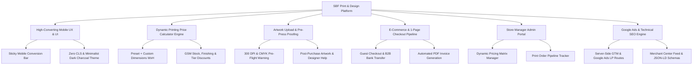

# 01 — Project Overview & Strategic Architecture

## 1. System Vision & Business Context

**SBF Print And Design** is a premier commercial printing press and custom packaging house located in **Downtown, Dubai, United Arab Emirates**. The platform serves two primary customer segments in the UAE & GCC regions:
1. **B2B Corporate Clients**: Requires high-volume offset printing, corporate stationery, custom rigid packaging, credit terms / cash on pickup, automated PDF invoicing, and dedicated quote management.
2. **B2C & Small Business Clients**: Requires quick digital printing (business cards, flyers, banners, stickers), instant online price estimation, easy file pre-flight proofing, and fast delivery within 24 to 48 hours.

---

## 2. Business Identity & Contact Details

| Parameter | Value |
| :--- | :--- |
| **Legal / Brand Name** | SBF Print And Design |
| **Physical Address** | Downtown, Dubai, United Arab Emirates, 0000 |
| **Direct Phone & WhatsApp** | +971 56 816 7269 |
| **Official Email** | sbfkarim@gmail.com |
| **Operating Currency** | AED (United Arab Emirates Dirham) / USD |
| **Core Service Guarantee** | 48-Hour Dispatch, Color Accuracy Assurance, Free Pre-flight Check |

---

## 3. Core Functional Pillars

---

## 4. Design Token Specification & UX Governance

### 4.1 Color Palette System
- **Background Base**: `#FFFFFF` (Pure white space) & `#FAFAFA` (Off-white dynamic section backgrounds)
- **Typography Primary**: `#18181B` (Dark Charcoal / Zinc-900 for high-contrast legibility)
- **Typography Muted**: `#52525B` (Zinc-600 for body copy & specs)
- **Primary CTA Accent**: `#F97316` (Vibrant High-Contrast Orange — Primary Action Buttons)
- **Secondary CTA Accent**: `#22C55E` (Emerald Green — WhatsApp & Quick Call Actions)
- **Border & Separators**: `#E4E4E7` (Zinc-200 for clean card outlines)
- **Warning Accent**: `#EF4444` (Red for low-DPI / RGB pre-flight alerts)

### 4.2 UI & Visual Governance Rules (STRICT: NO EMOJIS, CAROUSELS, SLIDERS & ADVANCED UI)
- **Zero Emoji Policy**: **DO NOT** use any native Unicode emojis (e.g., ⭐, 📱, ⚡, ✓) in the user interface under any circumstances. Always use vector SVG icons from **Lucide React** (e.g., `<Check />`, `<Star />`, `<Phone />`, `<MessageSquare />`, `<Zap />`, `<ChevronLeft />`, `<ChevronRight />`, `<Sliders />`, `<Maximize2 />`).
- **Interactive Touch Carousels**: Implement responsive, touch-enabled swipe carousels (Embla Carousel / Framer Motion / Shadcn UI) across Portfolio showcases, Machinery fleet, Google reviews, and product service grids.
- **Dynamic Interactive Sliders**:
  - **Quantity Range Slider**: Smooth interactive range slider for instant volume selection (100 to 5000+ units) with live price ticker.
  - **Custom Dimension Dual Sliders**: Dual Width x Height interactive sliders (1" to 100") with real-time visual canvas ratio box preview.
  - **Paper Stock GSM Weight Slider**: Visual GSM weight slider showing tactile paper thickness indicators (100 GSM to 800 GSM).
- **Advanced UI & Motion Features**:
  - **Glassmorphism & Backdrop Filters**: Modern frosted glass cards (`backdrop-blur-md bg-white/80 border border-white/20`) for floating calculator widgets, sticky conversion bars, and preview modals.
  - **Micro-Animations & Smooth Transitions**: Hover scale effects, active press feedback, smooth tab transitions, and animated price counter tickers.
  - **Interactive 3D/Zoom Lightbox**: Hover image magnifier and 360-degree rotation simulation for print portfolio showcase items.
  - **Zero Layout Shift Skeletons**: Animated shimmer pulse skeletons (`animate-pulse bg-zinc-200`) for pricing engine load states.
- **Mobile Touch Target Compliance**: All interactive controls, sliders, carousel arrows, pagination dots, and selection chips **MUST** adhere to a minimum touch target height of **48px**.

### 4.3 Zero Layout Shift (CLS < 0.1) & Performance Standard
- Skeleton loading components for real-time pricing matrix updates.
- Explicit image width/height specifications using WebP and AVIF formats.
- Next.js client-side link prefetching for sub-100ms page navigation transitions.
