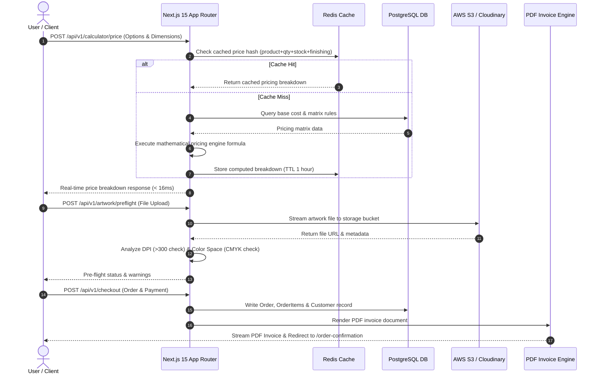

# 04 — Backend Architecture, Database Schemas & API Specification

## 1. System Architecture & Component Interactions

The backend of **SBF Print And Design** is engineered using **Next.js 15 Server Components & Route Handlers**, integrated with **PostgreSQL** for relational data persistence, **Redis** for sub-millisecond pricing engine caching, and **AWS S3 / Cloudinary** for artwork pre-press storage and thumbnail rendering.



---

## 2. PostgreSQL Data Schemas & Entity Definitions

### Table 1: `products`
```sql
CREATE TABLE products (
    id UUID PRIMARY KEY DEFAULT gen_random_uuid(),
    name VARCHAR(255) NOT NULL,
    slug VARCHAR(255) UNIQUE NOT NULL,
    category VARCHAR(100) NOT NULL, -- 'cards', 'packaging', 'banners', 'flyers', 'labels'
    description TEXT,
    base_unit_price NUMERIC(10, 4) NOT NULL DEFAULT 0.0000,
    min_quantity INT NOT NULL DEFAULT 100,
    is_active BOOLEAN NOT NULL DEFAULT TRUE,
    created_at TIMESTAMP WITH TIME ZONE DEFAULT CURRENT_TIMESTAMP
);
```

### Table 2: `paper_stocks`
```sql
CREATE TABLE paper_stocks (
    id UUID PRIMARY KEY DEFAULT gen_random_uuid(),
    product_id UUID REFERENCES products(id) ON DELETE CASCADE,
    name VARCHAR(255) NOT NULL, -- e.g. '300 GSM Matte', '350 GSM Velvet', 'Rigid Board'
    gsm INT NOT NULL,
    cost_multiplier NUMERIC(6, 3) NOT NULL DEFAULT 1.000,
    is_default BOOLEAN DEFAULT FALSE
);
```

### Table 3: `finishings`
```sql
CREATE TABLE finishings (
    id UUID PRIMARY KEY DEFAULT gen_random_uuid(),
    name VARCHAR(255) NOT NULL, -- e.g. 'Gloss Lamination', 'Spot UV', 'Gold Foil'
    fixed_setup_cost NUMERIC(10, 2) NOT NULL DEFAULT 0.00,
    per_unit_cost NUMERIC(10, 4) NOT NULL DEFAULT 0.0000,
    per_sqin_cost NUMERIC(10, 6) NOT NULL DEFAULT 0.000000
);
```

### Table 4: `quantity_tier_discounts`
```sql
CREATE TABLE quantity_tier_discounts (
    id UUID PRIMARY KEY DEFAULT gen_random_uuid(),
    product_id UUID REFERENCES products(id) ON DELETE CASCADE,
    min_quantity INT NOT NULL,
    max_quantity INT NOT NULL,
    discount_percentage NUMERIC(5, 2) NOT NULL DEFAULT 0.00 -- e.g. 15.00 for 15% off
);
```

### Table 5: `orders`
```sql
CREATE TABLE orders (
    id UUID PRIMARY KEY DEFAULT gen_random_uuid(),
    order_number VARCHAR(50) UNIQUE NOT NULL, -- e.g. 'SBF-2026-8819'
    customer_name VARCHAR(255) NOT NULL,
    customer_email VARCHAR(255) NOT NULL,
    customer_phone VARCHAR(50) NOT NULL,
    delivery_address TEXT NOT NULL,
    city VARCHAR(100) DEFAULT 'Dubai',
    country VARCHAR(100) DEFAULT 'United Arab Emirates',
    subtotal_price NUMERIC(10, 2) NOT NULL,
    vat_amount NUMERIC(10, 2) NOT NULL, -- 5% UAE VAT
    total_price NUMERIC(10, 2) NOT NULL,
    payment_method VARCHAR(50) NOT NULL, -- 'card_online', 'bank_transfer', 'cash_pickup'
    payment_status VARCHAR(50) NOT NULL DEFAULT 'pending', -- 'pending', 'paid', 'failed'
    pipeline_status VARCHAR(50) NOT NULL DEFAULT 'order_received', 
    -- Stage 1: 'order_received', Stage 2: 'artwork_review', Stage 3: 'in_press', Stage 4: 'quality_check', Stage 5: 'ready_for_pickup'
    created_at TIMESTAMP WITH TIME ZONE DEFAULT CURRENT_TIMESTAMP
);
```

### Table 6: `order_items` & `artworks`
```sql
CREATE TABLE order_items (
    id UUID PRIMARY KEY DEFAULT gen_random_uuid(),
    order_id UUID REFERENCES orders(id) ON DELETE CASCADE,
    product_id UUID REFERENCES products(id),
    width NUMERIC(8, 2) NOT NULL,
    height NUMERIC(8, 2) NOT NULL,
    unit_dimension VARCHAR(20) DEFAULT 'inches', -- 'inches', 'cm', 'mm'
    paper_stock_id UUID REFERENCES paper_stocks(id),
    finishing_id UUID REFERENCES finishings(id),
    sides VARCHAR(20) NOT NULL DEFAULT 'single', -- 'single', 'double'
    quantity INT NOT NULL,
    unit_price NUMERIC(10, 4) NOT NULL,
    total_price NUMERIC(10, 2) NOT NULL,
    artwork_option VARCHAR(50) NOT NULL -- 'upload_now', 'send_later', 'designer_help'
);

CREATE TABLE artworks (
    id UUID PRIMARY KEY DEFAULT gen_random_uuid(),
    order_item_id UUID REFERENCES order_items(id) ON DELETE CASCADE,
    file_name VARCHAR(255) NOT NULL,
    file_url TEXT NOT NULL,
    file_size_mb NUMERIC(6, 2) NOT NULL,
    dpi_detected INT DEFAULT 300,
    color_mode_detected VARCHAR(20) DEFAULT 'CMYK',
    has_bleed_warning BOOLEAN DEFAULT FALSE,
    is_approved_by_admin BOOLEAN DEFAULT FALSE,
    uploaded_at TIMESTAMP WITH TIME ZONE DEFAULT CURRENT_TIMESTAMP
);
```

### Table 7: `leads`
```sql
CREATE TABLE leads (
    id UUID PRIMARY KEY DEFAULT gen_random_uuid(),
    type VARCHAR(50) NOT NULL, -- 'sample_kit', 'custom_quote'
    name VARCHAR(255) NOT NULL,
    email VARCHAR(255),
    phone VARCHAR(50) NOT NULL,
    address TEXT,
    notes TEXT,
    created_at TIMESTAMP WITH TIME ZONE DEFAULT CURRENT_TIMESTAMP
);
```

---

## 3. Core API Endpoint Specification

### 3.1 Price Calculation API
- **Endpoint**: `POST /api/v1/calculator/price`
- **Request Payload**:
  ```json
  {
    "productId": "prod_business_card",
    "width": 3.5,
    "height": 2.0,
    "unit": "inches",
    "paperStockId": "stock_350_velvet",
    "finishingId": "finish_gold_foil",
    "sides": "double",
    "quantity": 1000
  }
  ```
- **Response Payload**:
  ```json
  {
    "success": true,
    "currency": "AED",
    "unitPrice": 0.185,
    "subtotal": 185.00,
    "vatAmount": 9.25,
    "totalPrice": 194.25,
    "breakdown": {
      "basePaperCost": 110.00,
      "finishingCost": 45.00,
      "sideMultiplierCost": 30.00,
      "tierDiscountPercentage": 15.0,
      "tierSavingsAmount": 27.75
    }
  }
  ```

### 3.2 Artwork Pre-Flight API
- **Endpoint**: `POST /api/v1/artwork/preflight`
- **Content-Type**: `multipart/form-data`
- **Checks**: Verifies resolution (>300 DPI), color space (CMYK vs RGB), and bleed bounds. Returns file URL and warning array.

### 3.3 Automated PDF Invoice API
- **Endpoint**: `GET /api/v1/orders/[id]/invoice`
- **Function**: Dynamically generates binary PDF stream matching UAE VAT invoice layout standards including SBF Print And Design logo, VAT ID, customer details, print specifications, subtotal, 5% VAT, and payment status badge.

### 3.4 CRM Lead Export API
- **Endpoint**: `GET /api/v1/admin/leads/export`
- **Function**: Returns standard CSV payload containing all leads and sample kit requests for sales follow-up.
