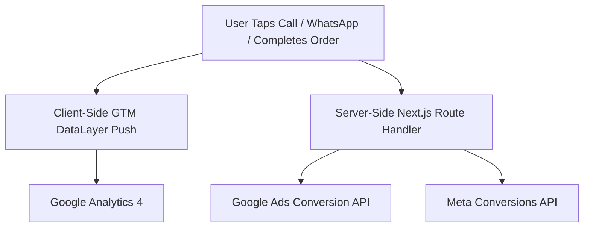

# 06 — Google Ads Engine, Analytics & Technical SEO Specification

## 1. Google Ads & Conversion Tracking Infrastructure

To maximize ROI on Google Ads campaigns targeting Dubai and UAE print buyers, the platform implements **Server-Side & Client-Side Dual Conversion Tracking** integrated with Google Tag Manager.

### 1.1 Google Tag Manager Container
- **Container ID**: `GTM-T9XCPM9P`
- **Next.js 15 Implementation**: Implemented via `@next/third-parties/google` (`<GoogleTagManager gtmId="GTM-T9XCPM9P" />`) or inline in `app/layout.tsx`.
- **Global Placement**:
  ```html
  <!-- Head Script -->
  <script>(function(w,d,s,l,i){w[l]=w[l]||[];w[l].push({'gtm.start':
  new Date().getTime(),event:'gtm.js'});var f=d.getElementsByTagName(s)[0],
  j=d.createElement(s),dl=l!='dataLayer'?'&l='+l:'';j.async=true;j.src=
  'https://www.googletagmanager.com/gtm.js?id='+i+dl;f.parentNode.insertBefore(j,f);
  })(window,document,'script','dataLayer','GTM-T9XCPM9P');</script>

  <!-- Body NoScript -->
  <noscript><iframe src="https://www.googletagmanager.com/ns.html?id=GTM-T9XCPM9P"
  height="0" width="0" style="display:none;visibility:hidden"></iframe></noscript>
  ```



### Key Conversion Events Tracked
1. **`purchase`**: Fired upon successful order payment or B2B checkout completion. Transmits order value, currency (AED), transaction ID, and ordered print products.
2. **`whatsapp_click`**: Fired when user taps any WhatsApp direct trigger (`+971 052 506 9091`).
3. **`phone_call_click`**: Fired when user taps click-to-call link.
4. **`sample_kit_request`**: Fired upon submission of 3-field paper sample kit lead magnet.
5. **`calculator_price_generated`**: Fired when user interacts with real-time price calculator.

---

## 2. Dedicated Google Ads Landing Page Routes (`/lp/*`)

Streamlined landing routes are built without header distraction menus to achieve high Google Ads Quality Scores and maximize conversion rate:
- **`/lp/business-cards`**: Direct focus on luxury business card printing, 350 GSM velvet stock, gold foil finishes, and 48-hour delivery.
- **`/lp/custom-packaging`**: Direct focus on rigid corporate gift boxes and custom product packaging in Dubai.

---

## 3. Google Merchant Center Feed API (`/api/feed.xml`)

Auto-generated XML product feed route updating dynamically in accordance with Google Shopping Ads standards:

```xml
<?xml version="1.0" encoding="UTF-8"?>
<rss version="2.0" xmlns:g="http://base.google.com/ns/1.0">
  <channel>
    <title>SBF Print And Design Product Catalog</title>
    <link>https://sbfprint.ae</link>
    <description>Premium Printing &amp; Custom Packaging in Dubai</description>
    <item>
      <g:id>sbf-bc-100</g:id>
      <g:title>Luxury Business Cards (350 GSM Velvet)</g:title>
      <g:description>Premium double-sided business cards printed on 350 GSM Velvet stock with optional gold foil in Dubai.</g:description>
      <g:link>https://sbfprint.ae/calculator?product=business-cards</g:link>
      <g:image_link>https://sbfprint.ae/images/portfolio/business-cards.webp</g:image_link>
      <g:condition>new</g:condition>
      <g:availability>in_stock</g:availability>
      <g:price>45.00 AED</g:price>
      <g:brand>SBF Print And Design</g:brand>
    </item>
  </channel>
</rss>
```

---

## 4. Technical SEO & Schema Markup

### 4.1 JSON-LD Structured Data (`LocalBusiness` & `Product`)

Embedded automatically in Next.js Server Component layouts:

```json
{
  "@context": "https://schema.org",
  "@graph": [
    {
      "@type": "LocalBusiness",
      "@id": "https://sbfprint.ae/#organization",
      "name": "SBF Print And Design",
      "image": "https://sbfprint.ae/images/logo.png",
      "telephone": "+971525069091",
      "email": "sbfkarim@gmail.com",
      "hasMap": "https://www.google.com/maps?cid=4646316211352300491",
      "sameAs": [
        "https://www.google.com/maps?cid=4646316211352300491"
      ],
      "address": {
        "@type": "PostalAddress",
        "streetAddress": "Down town",
        "addressLocality": "Dubai",
        "addressCountry": "AE",
        "postalCode": "0000"
      },
      "geo": {
        "@type": "GeoCoordinates",
        "latitude": 25.1972,
        "longitude": 55.2744
      },
      "openingHoursSpecification": {
        "@type": "OpeningHoursSpecification",
        "dayOfWeek": ["Monday", "Tuesday", "Wednesday", "Thursday", "Friday", "Saturday"],
        "opens": "08:00",
        "closes": "20:00"
      },
      "priceRange": "$$"
    },
    {
      "@type": "Product",
      "name": "Custom Commercial Printing & Packaging",
      "aggregateRating": {
        "@type": "AggregateRating",
        "ratingValue": "4.9",
        "reviewCount": "250"
      }
    }
  ]
}
```

---

## 5. Automated Sitemap & Robots Handlers

- **`sitemap.ts`**: Auto-generates clean permalinks for `/`, `/calculator`, `/portfolio`, `/about`, `/sample-kit`, `/contact`, `/services/*`, and `/lp/*`.
- **`robots.ts`**: Configures search engine crawling preferences and links directly to `sitemap.xml`.
